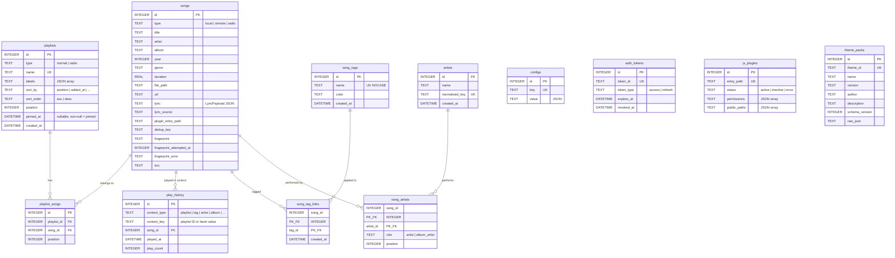
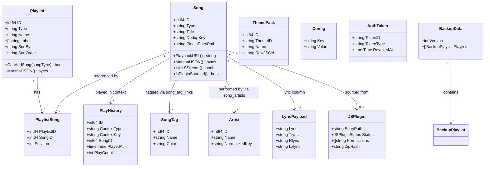

# Data Model Design


This document is based on the following source files:

- [internal/models/models.go](https://github.com/songloft-org/songloft/blob/main/internal/models/models.go) -- All domain models, DTOs, validation logic, and custom serialization
- [internal/models/backup.go](https://github.com/songloft-org/songloft/blob/main/internal/models/backup.go) -- Backup/restore data models
- [internal/models/lyric.go](https://github.com/songloft-org/songloft/blob/main/internal/models/lyric.go) -- Lyrics payload model and serialization
- [internal/models/constant.go](https://github.com/songloft-org/songloft/blob/main/internal/models/constant.go) -- Pagination constants
- [internal/database/sqlc/models.go](https://github.com/songloft-org/songloft/blob/main/internal/database/sqlc/models.go) -- sqlc-generated database row-mapping models
- [internal/database/migrations/0001_init.sql](https://github.com/songloft-org/songloft/blob/main/internal/database/migrations/0001_init.sql) -- Initial schema (6 tables + indexes + triggers + preset data; the plugin_storage table is in 0016)
- [internal/database/migrations/0005_lyric_source_manual.sql](https://github.com/songloft-org/songloft/blob/main/internal/database/migrations/0005_lyric_source_manual.sql) -- Adds manual to lyric_source
- [internal/database/migrations/0007_songs_year_genre.sql](https://github.com/songloft-org/songloft/blob/main/internal/database/migrations/0007_songs_year_genre.sql) -- Adds year/genre columns
- [internal/database/migrations/0008_songs_fingerprint.sql](https://github.com/songloft-org/songloft/blob/main/internal/database/migrations/0008_songs_fingerprint.sql) -- Adds fingerprint column
- [internal/database/migrations/0029_fingerprint_cost_control.sql](https://github.com/songloft-org/songloft/blob/main/internal/database/migrations/0029_fingerprint_cost_control.sql) -- Adds fingerprint_attempted_at column (no retry on failure)
- [internal/database/migrations/0030_play_history.sql](https://github.com/songloft-org/songloft/blob/main/internal/database/migrations/0030_play_history.sql) -- play_history table
- [internal/database/migrations/0031_theme_packs.sql](https://github.com/songloft-org/songloft/blob/main/internal/database/migrations/0031_theme_packs.sql) -- theme_packs table
- [internal/database/migrations/0034_playlist_sort_preference.sql](https://github.com/songloft-org/songloft/blob/main/internal/database/migrations/0034_playlist_sort_preference.sql) -- Adds sort_by/sort_order to playlists
- [internal/database/migrations/0036_song_tags.sql](https://github.com/songloft-org/songloft/blob/main/internal/database/migrations/0036_song_tags.sql) -- song_tags + song_tag_links tables
- [internal/database/migrations/0037_fingerprint_error.sql](https://github.com/songloft-org/songloft/blob/main/internal/database/migrations/0037_fingerprint_error.sql) -- Adds fingerprint_error to songs
- [internal/database/migrations/0038_song_artists.sql](https://github.com/songloft-org/songloft/blob/main/internal/database/migrations/0038_song_artists.sql) -- artists + song_artists tables


## Table of Contents

1. [Overview](#1-overview)
2. [ER Diagram](#2-er-diagram)
3. [Song Model](#3-song-model)
4. [Playlist Model](#4-playlist-model)
5. [PlaylistSong Association Model](#5-playlistsong-association-model)
6. [Config Model](#6-config-model)
7. [AuthToken Model](#7-authtoken-model)
8. [JSPlugin Model](#8-jsplugin-model)
9. [ThemePack Model](#9-themepack-model)
10. [SongTag Custom Tag Model](#10-songtag-custom-tag-model)
11. [Artist Model](#11-artist-model)
12. [Lyrics Model](#12-lyrics-model)
13. [Backup Model](#13-backup-model)
14. [Request/Response DTOs](#14-requestresponse-dtos)
15. [Model Relationship Class Diagram](#15-model-relationship-class-diagram)

---

## 1. Overview

Songloft's data persistence layer is based on **SQLite**, using a layered access stack of **goose migration + sqlc fixed SQL + squirrel dynamic SQL**. The domain models are defined in the `internal/models/` package, separate from the sqlc auto-generated row-mapping models (`internal/database/sqlc/models.go`), with the Repository layer responsible for the conversion between the two.

The current schema has a total of **13 tables**: `songs`, `playlists`, `playlist_songs`, `play_history`, `configs`, `auth_tokens`, `js_plugins`, `plugin_storage`, `theme_packs`, `song_tags`, `song_tag_links`, `artists`, `song_artists`, evolved from the initial version to the current state through 38 migration files (0001–0038). The `updated_at` column of the core tables is automatically maintained by a SQLite TRIGGER.

**Section sources**
- [internal/database/migrations/0001_init.sql:1-190](https://github.com/songloft-org/songloft/blob/main/internal/database/migrations/0001_init.sql#L1-L190) -- Complete initial schema

---

## 2. ER Diagram



**Diagram sources**
- [internal/database/migrations/0001_init.sql:3-103](https://github.com/songloft-org/songloft/blob/main/internal/database/migrations/0001_init.sql#L3-L103) -- Table definitions
- [internal/database/migrations/0007_songs_year_genre.sql](https://github.com/songloft-org/songloft/blob/main/internal/database/migrations/0007_songs_year_genre.sql) -- year/genre
- [internal/database/migrations/0008_songs_fingerprint.sql](https://github.com/songloft-org/songloft/blob/main/internal/database/migrations/0008_songs_fingerprint.sql) -- fingerprint
- [internal/database/migrations/0029_fingerprint_cost_control.sql](https://github.com/songloft-org/songloft/blob/main/internal/database/migrations/0029_fingerprint_cost_control.sql) -- fingerprint_attempted_at

---

## 3. Song Model

Song is the most core model in the system, containing **37 persisted fields + 5 runtime-computed fields** (of which 3 are JSON-visible: `lyric_url`/`source_url`/`source_cover_url`, and 2 are used internally: `CueStartSeconds`/`CueEndSeconds`), carrying three business forms: local songs, network songs, and radio. Additionally, the database has two more columns -- `fingerprint_attempted_at`(0029) and `fingerprint_error`(0037) -- accessed separately by sqlc queries and not mapped to the Go Song struct. The type is constrained by `CHECK(type IN ('local', 'remote', 'radio'))`.

| Constant | Value | Required Field |
|------|------|----------|
| `TypeLocal` | `local` | `file_path` |
| `TypeRemote` | `remote` | `url` |
| `TypeRadio` | `radio` | `url` |

### 3.1 Field Grouping

**Basic information**: `id`(PK), `type`, `title`, `artist`, `album`, `year`(0007), `genre`(0007), `track`(0020), `language`(0022), `style`(0022), `duration`

**File and audio**: `file_path`, `url`, `file_size`, `format`, `bit_rate`, `sample_rate`, `is_live`, `is_video`(0024), `file_modified_at`(0019), `cache_path`(0014)

**CUE track splitting**: `cue_source_path`(0018), `cue_track_index`(0018), `cue_audio_path`(0018)

**Cover art**: `cover_path`(json:"-"), `cover_url`(rewritten on serialization)

**Lyrics**: `lyric`(json:"-", LyricPayload JSON), `lyric_source`(json:"-"), `lyric_remote_url`, `lyric_url`(runtime)

**Plugin and deduplication**: `plugin_entry_path`, `source_data`(opaque JSON), `dedup_key`, `source_url`(runtime)

**Identification**: `fingerprint`(0008, Chromaprint over the first 120s), `fingerprint_duration`(0008, full-file length), `fingerprint_attempted_at`(0029, unix seconds, 0 = never attempted; failures are persisted too so scans don't re-run ffmpeg every round), `fingerprint_error`(0037, records the error message on extraction failure, not in the Go Song struct, accessed separately by sqlc), `isrc`(0009)

**Timestamps**: `added_at`, `updated_at`(TRIGGER)

**Section sources**
- [internal/models/models.go:69-101](https://github.com/songloft-org/songloft/blob/main/internal/models/models.go#L69-L101) -- Song struct

### 3.2 Custom MarshalJSON

Song implements `MarshalJSON()`, which **rewrites four fields** on serialization so that clients need not concern themselves with internal storage details:

| Field | Rewrite Logic | Example |
|------|----------|------|
| `url` | `PlaybackURL()` unified playback endpoint | `/api/v1/songs/42/play` |
| `cover_url` | `CoverURLPath()`, empty when no cover art | `/api/v1/songs/42/cover` |
| `lyric_url` | `LyricURLPath()`, empty when no lyrics | `/api/v1/songs/42/lyric` |
| `source_url` | remote/radio filled with the original URL | `https://stream.example.com/live.m3u8` |

The implementation uses a value-copy trick: `cp := *s` first copies the Song, modifies `url`/`cover_url`/`lyric_url`/`source_url` etc. on the copy, then serializes the copy via `type songAlias Song` (avoiding recursive `MarshalJSON` calls). This neither pollutes the original `*Song` object nor incurs the side effects of the old approach that modified the receiver directly. The original URL is kept in the database and not exposed to the client; all playback is dispatched uniformly through `/api/v1/songs/{id}/play`.

**Section sources**
- [internal/models/models.go:268-283](https://github.com/songloft-org/songloft/blob/main/internal/models/models.go#L268-L283) -- MarshalJSON

### 3.3 PlaybackURL and HLS Rules

- **Ordinary songs**: `/api/v1/songs/{id}/play`
- **HLS radio** (URL suffix `.m3u8`/`.m3u`): `/api/v1/songs/{id}/play.m3u8`

Reason for appending the `.m3u8` suffix: ExoPlayer/AVPlayer selects the MediaSource type by URL suffix, and without a suffix it falls to ProgressiveMediaSource, making HLS live streams unplayable. `IsHLSStream()` determines this by parsing the URL path suffix, and only takes effect for `TypeRadio`.

**Section sources**
- [internal/models/models.go:108-139](https://github.com/songloft-org/songloft/blob/main/internal/models/models.go#L108-L139) -- PlaybackURL and IsHLSStream

### 3.4 CoverURLPath and LyricURLPath

Both methods follow the principle of "return the endpoint if present, return empty if absent," avoiding clients making requests destined for 404:

- **CoverURLPath**: returns `/api/v1/songs/{id}/cover` when either `CoverPath` or `CoverURL` is non-empty
- **LyricURLPath**: returns `/api/v1/songs/{id}/lyric` when `Lyric` is non-empty, or when `LyricSource=="url"` and `LyricRemoteURL` is non-empty

**Section sources**
- [internal/models/models.go:143-168](https://github.com/songloft-org/songloft/blob/main/internal/models/models.go#L143-L168) -- URL generation logic

### 3.5 DedupKey Deduplication Mechanism

`dedup_key` is used for network song deduplication, typically in the form `<platform>:<platform_id>`. Together with `plugin_entry_path` it forms a **conditional unique index** (partial unique index), taking effect only for rows where `dedup_key != ''`:

```sql
CREATE UNIQUE INDEX idx_songs_dedup_key_unique
    ON songs(plugin_entry_path, dedup_key) WHERE dedup_key != '';
```

**Section sources**
- [internal/database/migrations/0001_init.sql:122](https://github.com/songloft-org/songloft/blob/main/internal/database/migrations/0001_init.sql#L122) -- dedup_key index

---

## 4. Playlist Model

| Field | Go Type | JSON | Description |
|------|---------|------|------|
| `ID` | `int64` | `id` | Auto-increment primary key |
| `Type` | `string` | `type` | `normal` or `radio` (CHECK constraint) |
| `Name` | `string` | `name` | Globally unique (`idx_playlists_name_unique`) |
| `Description` | `string` | `description` | Description |
| `CoverPath` | `string` | `-` (not exposed) | Local cover art path |
| `CoverURL` | `string` | `cover_url` | Rewritten on serialization to `/api/v1/playlists/{id}/cover` |
| `Labels` | `[]string` | `labels` | JSON array (DB default `'[]'`) |
| `SortBy` | `string` | `sort_by` | View sort field (default `position`, options: `added_at`/`file_modified_at`/`title`/`artist`/`duration`) (added in 0034) |
| `SortOrder` | `string` | `sort_order` | View sort direction (default `asc`, option: `desc`) (added in 0034) |
| `SongCount` | `int` | `song_count` | Runtime-computed (not persisted) |
| `RemoteCount` | `int` | `remote_count` | Number of remote songs in the playlist (`songs.type=remote`); >0 means "network playlist"; only populated in list APIs, always 0 in detail APIs |
| `PinnedAt` | `*time.Time` | `pinned_at,omitempty` | Pin timestamp; `nil` means unpinned. Pinned playlists always sort first in listings, and multiple pinned playlists sort by this field descending (most recently pinned first) |
| `CreatedAt` | `time.Time` | `created_at` | Creation time |

The DB layer additionally has a `position` column (for ordering) and timestamp columns. `MarshalJSON()` rewrites `cover_url` just like Song.

**CanAddSong validation**: `normal` playlists accept only `local`/`remote`, and `radio` playlists accept only `radio`.

**Labels**: `built_in` marks built-in, non-deletable playlists (preset id=1 "Favorites", id=2 "Radio Favorites"), and `auto_created` marks playlists automatically created during scanning.

**Section sources**
- [internal/models/models.go:253-303](https://github.com/songloft-org/songloft/blob/main/internal/models/models.go#L253-L303) -- Playlist struct and CanAddSong
- [internal/database/migrations/0001_init.sql:163-166](https://github.com/songloft-org/songloft/blob/main/internal/database/migrations/0001_init.sql#L163-L166) -- Preset playlists

---

## 5. PlaylistSong Association Model

Implements the **M:N many-to-many association** between playlists and songs: `id`(PK), `playlist_id`(FK), `song_id`(FK), `position`, `added_at`.

Key constraints: **UNIQUE(playlist_id, song_id)** prevents duplicate additions; **ON DELETE CASCADE** follows playlist/song deletion; the `(playlist_id, position)` composite index accelerates ordering.

**Section sources**
- [internal/models/models.go:306-326](https://github.com/songloft-org/songloft/blob/main/internal/models/models.go#L306-L326) -- PlaylistSong
- [internal/database/migrations/0001_init.sql:45-55](https://github.com/songloft-org/songloft/blob/main/internal/database/migrations/0001_init.sql#L45-L55) -- Table constraints

---

## 5.1 PlayHistory Model

Records recently played songs per "playback context", so users can return to a playlist / artist / album and pick up where they left off (songloft-org/songloft#333).

Fields: `id`(PK), `context_type`, `context_key`, `song_id`(FK), `played_at`, `play_count`.

**A context is identified by the (context_type, context_key) pair**:
- Playlist → `("playlist", "<playlist ID>")`
- Custom tag → `("tag", "<tag ID>")`
- Facet dimension → `("artist", "Jay Chou")` / `("album", "Fantasy")` etc. Values reuse the 7 dimensions of `songFacetColumn` (artist/album/genre/year/decade/language/style) rather than defining a separate enum

Key constraints and design trade-offs:

| Item | Description |
|---|---|
| **UNIQUE(context_type, context_key, song_id)** | Deduplication relies on the DB constraint plus upsert (`ON CONFLICT DO UPDATE` refreshes `played_at` and increments `play_count`), not on application-level lookups |
| **50-entry cap per context** | `services.MaxPlayHistoryPerContext`. The insert and the trim run in the same transaction (`RunInTx`) so a mid-way failure cannot leave excess rows. Deliberately a Go constant rather than a config item |
| **`song_id` foreign key CASCADE** | History is cleaned up automatically when a song is deleted from the library |
| **`context_key` is TEXT, so no foreign key to playlists** | `PlaylistService` explicitly calls `ClearByPlaylist` on deletion. Batch deletion only clears playlists that were actually removed -- built-in playlists (Favorites / Radio Favorites) are never deleted, so their history must survive |
| **Index `(context_type, context_key, played_at DESC, id DESC)`** | `played_at` has second-level precision and will collide; `id DESC` acts as a tie-breaker so read and trim ordering stay deterministic |
| **Song removed from a playlist but still in the library** | The history row is kept (history is history). The client locates it via the ordered ID list on playback and reports it as stale when not found |

**Section sources**
- [internal/database/migrations/0030_play_history.sql](https://github.com/songloft-org/songloft/blob/main/internal/database/migrations/0030_play_history.sql) -- Table structure and indexes
- [internal/services/play_history_service.go](https://github.com/songloft-org/songloft/blob/main/internal/services/play_history_service.go) -- In-transaction upsert + trim, context type validation
- [internal/database/play_history_repository.go](https://github.com/songloft-org/songloft/blob/main/internal/database/play_history_repository.go) -- Repository

---

## 6. Config Model

Key-value pattern, with `key` globally unique and `value` being a JSON string. Preset configuration items:

| key | Description | Migration |
|-----|------|------|
| `music_path` | Music directory and excluded directories | 0001 |
| `scan_config` | Automatic scanning, interval, formats | 0001 |
| `jwt_secret` | JWT secret (randomly generated with `randomblob`) | 0001 |
| `source_validation` / `source_fallback` / `source_metrics` | Audio source validation/fallback/metrics | 0001 |
| `plugin_registries` | Official plugin registry URL | 0006 |
| `scan_auto_create_playlists` | Whether to automatically create playlists | 0012 |

**Section sources**
- [internal/models/models.go:329-345](https://github.com/songloft-org/songloft/blob/main/internal/models/models.go#L329-L345) -- Config struct
- [internal/database/migrations/0001_init.sql:169-178](https://github.com/songloft-org/songloft/blob/main/internal/database/migrations/0001_init.sql#L169-L178) -- Preset data

---

## 7. AuthToken Model

JWT dual-token authentication; the `auth_tokens` table records token metadata and **revocation audit**.

| Field | Description |
|------|------|
| `token_id` | Unique identifier (UNIQUE) |
| `token_type` | `access` (short-lived) or `refresh` (long-lived), CHECK constraint |
| `client_info` | User-Agent tracking |
| `expires_at` | Expiration time |
| `revoked_at` | Revocation time (nullable, `sql.NullTime`); checking for null tells whether it has been revoked |
| `revoked_by` / `revoked_reason` | Revocation audit (who, why) |

`TokenInfo` is the client-friendly version of `AuthToken` (with the internal `ID` removed), used for the token list API.

**Section sources**
- [internal/models/models.go:417-439](https://github.com/songloft-org/songloft/blob/main/internal/models/models.go#L417-L439) -- AuthToken and TokenInfo
- [internal/database/migrations/0001_init.sql:67-78](https://github.com/songloft-org/songloft/blob/main/internal/database/migrations/0001_init.sql#L67-L78) -- Table definition

---

## 8. JSPlugin Model

Metadata and runtime status of QuickJS sandbox plugins. Core fields:

| Field | Description |
|------|------|
| `entry_path` | Route prefix (UNIQUE), e.g. `"myplugin"` |
| `main` | Entry file (default `main.js`) |
| `permissions` | JSON array, e.g. `["net","storage","fs:music"]` |
| `public_paths` | Path prefixes not requiring JWT (added in 0010) |
| `external_paths` | Accessible external absolute paths (added in 0013) |
| `icon` | Plugin icon (added in 0011) |
| `status` | `active` / `inactive` (default) / `error`, CHECK constraint |
| `zip_hash` / `entry_hash` | SHA256 hashes, used for file fingerprint hot-reload detection |
| `file_path` | Relative path of the ZIP file |

At runtime, the file system hash is compared with the database record, and a reload is automatically triggered when they mismatch.

**Section sources**
- [internal/models/models.go:509-543](https://github.com/songloft-org/songloft/blob/main/internal/models/models.go#L509-L543) -- JSPlugin struct and status enum
- [internal/database/migrations/0001_init.sql:81-103](https://github.com/songloft-org/songloft/blob/main/internal/database/migrations/0001_init.sql#L81-L103) -- js_plugins table

---

## 9. ThemePack Model

Declarative JSON theme packs that let users customize colors, border radius, and gradients (songloft-org/songloft#337). `raw_json` stores the complete original JSON, which the frontend reads and renders directly; the top-level fields are used for indexing/queries.

| Field | Go Type | JSON | Description |
|------|---------|------|------|
| `ID` | `int64` | `id` | Auto-increment primary key |
| `ThemeID` | `string` | `theme_id` | Globally unique identifier (UNIQUE) |
| `Name` | `string` | `name` | Theme name |
| `Version` | `string` | `version` | Version number (default `1.0.0`) |
| `Author` | `string` | `author` | Author |
| `Description` | `string` | `description` | Description |
| `SchemaVersion` | `int` | `schema_version` | Theme JSON schema version (default 1) |
| `RawJSON` | `string` | `raw_json` | Complete theme JSON |
| `CreatedAt` | `time.Time` | `created_at` | Creation time |
| `UpdatedAt` | `time.Time` | `updated_at` | Update time (maintained by TRIGGER) |

**Section sources**
- [internal/database/migrations/0031_theme_packs.sql](https://github.com/songloft-org/songloft/blob/main/internal/database/migrations/0031_theme_packs.sql) -- Table structure and triggers

---

## 10. SongTag Custom Tag Model

User-defined song tags, implementing the M:N many-to-many relationship between songs and tags via the `song_tag_links` association table.

**song_tags table**:

| Field | Type | Description |
|------|------|------|
| `id` | INTEGER PK | Auto-increment primary key |
| `name` | TEXT, UNIQUE NOCASE | Tag name (case-insensitive unique) |
| `color` | TEXT | Display color (default empty) |
| `created_at` | DATETIME | Creation time |

**song_tag_links table**:

| Field | Type | Description |
|------|------|------|
| `song_id` | INTEGER FK | → songs(id) ON DELETE CASCADE |
| `tag_id` | INTEGER FK | → song_tags(id) ON DELETE CASCADE |
| `created_at` | DATETIME | Tagging time |

The primary key is the `(song_id, tag_id)` composite primary key. A separate index `idx_song_tag_links_tag` on `tag_id` accelerates "all songs with a given tag" queries. Bidirectional CASCADE ensures that deleting a song or a tag automatically cleans up the associations.

**Section sources**
- [internal/database/migrations/0036_song_tags.sql](https://github.com/songloft-org/songloft/blob/main/internal/database/migrations/0036_song_tags.sql) -- Table structure and indexes

---

## 11. Artist Model

Normalized multi-value artists: `artists` is the artist entity (deduplicated by `normalized_key`), and `song_artists` is the M:N many-to-many association between songs and artists, with `role` distinguishing lead artists (`artist`) from album artists (`album_artist`).

**artists table**:

| Field | Type | Description |
|------|------|------|
| `id` | INTEGER PK | Auto-increment primary key |
| `name` | TEXT | Artist name (original format for display) |
| `normalized_key` | TEXT, UNIQUE | Normalized key (`lower(trim(name))`), used for deduplication |
| `created_at` | DATETIME | Creation time |

**song_artists table**:

| Field | Type | Description |
|------|------|------|
| `song_id` | INTEGER FK | → songs(id) ON DELETE CASCADE |
| `artist_id` | INTEGER FK | → artists(id) ON DELETE CASCADE |
| `role` | TEXT, CHECK | `artist` (lead) or `album_artist` |
| `position` | INTEGER | Sort position (ordering for multiple artists, default 0) |
| `created_at` | DATETIME | Association time |

The primary key is the `(song_id, artist_id, role)` composite primary key. Migration 0038 automatically backfills the existing `songs.artist` full string as a single-row association (`role='artist'`); multi-value splitting only occurs during rescan/refresh when tags are re-read. The `songs.artist` column is demoted to a display-string cache.

**Section sources**
- [internal/database/migrations/0038_song_artists.sql](https://github.com/songloft-org/songloft/blob/main/internal/database/migrations/0038_song_artists.sql) -- Table structure, indexes, and backfill logic

---

## 12. Lyrics Model

### 12.1 LyricPayload

The structured storage format of the `songs.lyric` column, which is also the response form of `/api/v1/songs/{id}/lyric`:

| Field | JSON | Description |
|------|------|------|
| `Lyric` | `lyric` | Main lyrics (LRC text) |
| `Tlyric` | `tlyric` | Translated lyrics |
| `Rlyric` | `rlyric` | Romanized lyrics |
| `Lxlyric` | `lxlyric` | Word-by-word lyrics |

Key methods: `MarshalString()` returns an empty string (not `"{}"`) for an empty payload to preserve SQL null-check semantics; `UnmarshalLyric(raw)` is compatible with three historical forms -- empty string, valid JSON, and raw LRC text; `ApplyLyricToSong(s, text, source)` decides whether to store into `Lyric` or `LyricRemoteURL` based on the source type.

### 12.2 LyricSource Enum

| Value | Description |
|------|------|
| `file` | .lrc file in the same directory (supports case-variant extensions and `<filename>.lrc`; also read at runtime with priority) |
| `embedded` | Lyrics embedded in the audio |
| `url` | Fetched on demand at runtime (`LyricRemoteURL` holds the address) |
| `cached` | Text cached after URL fetch |
| `scraped` | Auto-fetched by lyrics search plugin |
| `manual` | Manually adjusted by the user, not overwritten by scanning (0005 migration extends the CHECK by rebuilding the table) |

**Section sources**
- [internal/models/lyric.go:13-79](https://github.com/songloft-org/songloft/blob/main/internal/models/lyric.go#L13-L79) -- Complete LyricPayload implementation
- [internal/models/models.go:27-33](https://github.com/songloft-org/songloft/blob/main/internal/models/models.go#L27-L33) -- Source constants

---

## 13. Backup Model

Versioned snapshot design (currently `BackupVersion = 1`), exporting playlists and songs as self-describing JSON.

- **BackupData**: top-level container, containing `version`, `exported_at`, `playlists[]`
- **BackupPlaylist**: playlist snapshot (name/type/description/labels/songs[])
- **BackupSong**: a slimmed-down version of Song (16 core fields), excluding reconstructable data such as ID, timestamps, lyrics, and cover art paths
- **ImportResult**: import statistics -- `playlists_created`/`playlists_merged`/`songs_created`/`songs_matched`/`songs_skipped`

**Section sources**
- [internal/models/backup.go:1-47](https://github.com/songloft-org/songloft/blob/main/internal/models/backup.go#L1-L47) -- Backup models

---

## 14. Request/Response DTOs

Domain models are decoupled from the HTTP layer through DTOs.

**Authentication**: `LoginRequest`(username/password) -> `LoginResponse`(access_token/refresh_token/expires_in/token_type); `RefreshTokenRequest`(refresh_token); `RevokeTokenRequest`(reason)

**Batch operations**: `BatchDeleteSongsRequest`(ids/delete_files) -> `BatchDeleteSongsResponse`(deleted); `BatchDeletePlaylistsRequest`(ids) -> `BatchDeletePlaylistsResponse`(deleted)

**Auto-create playlists**: `AutoCreatePlaylistsRequest`(include_subdirs) -> `AutoCreatePlaylistsResponse`(playlists[]/total); sub-structure `PlaylistInfo`(playlist_id/name/song_count)

**Configuration**: `CreateConfigRequest`(key/value); `UpdateConfigRequest`(value); `ConfigFilter`(keyword/limit/offset/order_by/order)

**Upgrade**: `RemoteVersionInfo`(version/git_commit/build_time/download_url_prefix/release_notes); `UpgradeProgress`(status/progress/current_step/error), with state transitions `idle -> uploading -> testing -> replacing -> restarting`, `idle -> downloading -> testing -> replacing -> restarting` (exceptions `failed`/`resetting`); `UploadedBinaryInfo` (binary info returned during upload upgrade)

**Generic**: `ErrorResponse`({error, detail}); `SuccessResponse`({message})

**Section sources**
- [internal/models/models.go:348-507](https://github.com/songloft-org/songloft/blob/main/internal/models/models.go#L348-L507) -- DTO definitions

---

## 15. Model Relationship Class Diagram



**Diagram sources**
- [internal/models/models.go](https://github.com/songloft-org/songloft/blob/main/internal/models/models.go) -- Domain models
- [internal/models/lyric.go](https://github.com/songloft-org/songloft/blob/main/internal/models/lyric.go) -- Lyrics model
- [internal/models/backup.go](https://github.com/songloft-org/songloft/blob/main/internal/models/backup.go) -- Backup model
