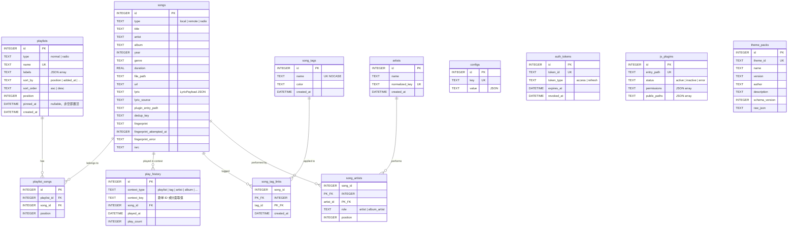
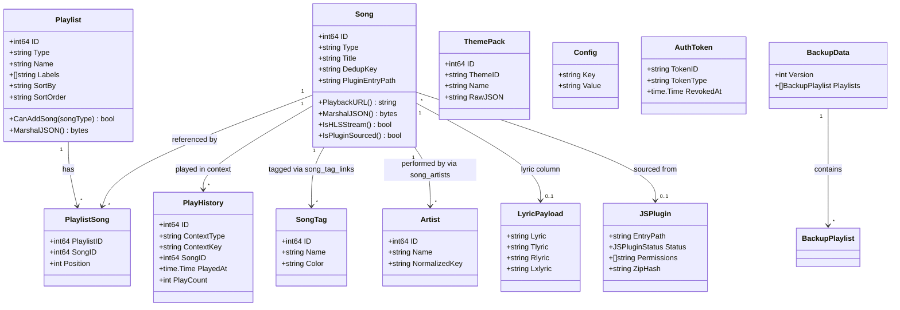

# 数据模型设计


本文档基于以下源文件编写：

- [internal/models/models.go](https://github.com/songloft-org/songloft/blob/main/internal/models/models.go) -- 所有领域模型、DTO、验证逻辑与自定义序列化
- [internal/models/backup.go](https://github.com/songloft-org/songloft/blob/main/internal/models/backup.go) -- 备份/恢复数据模型
- [internal/models/lyric.go](https://github.com/songloft-org/songloft/blob/main/internal/models/lyric.go) -- 歌词载荷模型与序列化
- [internal/models/constant.go](https://github.com/songloft-org/songloft/blob/main/internal/models/constant.go) -- 分页常量
- [internal/database/sqlc/models.go](https://github.com/songloft-org/songloft/blob/main/internal/database/sqlc/models.go) -- sqlc 生成的数据库行映射模型
- [internal/database/migrations/0001_init.sql](https://github.com/songloft-org/songloft/blob/main/internal/database/migrations/0001_init.sql) -- 初始 schema（6 张表 + 索引 + 触发器 + 预置数据；plugin_storage 表见 0016）
- [internal/database/migrations/0005_lyric_source_manual.sql](https://github.com/songloft-org/songloft/blob/main/internal/database/migrations/0005_lyric_source_manual.sql) -- lyric_source 新增 manual
- [internal/database/migrations/0007_songs_year_genre.sql](https://github.com/songloft-org/songloft/blob/main/internal/database/migrations/0007_songs_year_genre.sql) -- 新增 year/genre 列
- [internal/database/migrations/0008_songs_fingerprint.sql](https://github.com/songloft-org/songloft/blob/main/internal/database/migrations/0008_songs_fingerprint.sql) -- 新增 fingerprint 列
- [internal/database/migrations/0029_fingerprint_cost_control.sql](https://github.com/songloft-org/songloft/blob/main/internal/database/migrations/0029_fingerprint_cost_control.sql) -- 新增 fingerprint_attempted_at 列（失败不重试）
- [internal/database/migrations/0030_play_history.sql](https://github.com/songloft-org/songloft/blob/main/internal/database/migrations/0030_play_history.sql) -- play_history 表
- [internal/database/migrations/0031_theme_packs.sql](https://github.com/songloft-org/songloft/blob/main/internal/database/migrations/0031_theme_packs.sql) -- theme_packs 表
- [internal/database/migrations/0034_playlist_sort_preference.sql](https://github.com/songloft-org/songloft/blob/main/internal/database/migrations/0034_playlist_sort_preference.sql) -- playlists 新增 sort_by/sort_order
- [internal/database/migrations/0036_song_tags.sql](https://github.com/songloft-org/songloft/blob/main/internal/database/migrations/0036_song_tags.sql) -- song_tags + song_tag_links 表
- [internal/database/migrations/0037_fingerprint_error.sql](https://github.com/songloft-org/songloft/blob/main/internal/database/migrations/0037_fingerprint_error.sql) -- songs 新增 fingerprint_error
- [internal/database/migrations/0038_song_artists.sql](https://github.com/songloft-org/songloft/blob/main/internal/database/migrations/0038_song_artists.sql) -- artists + song_artists 表


## 目录

1. [概述](#1-概述)
2. [ER 关系图](#2-er-关系图)
3. [Song 歌曲模型](#3-song-歌曲模型)
4. [Playlist 歌单模型](#4-playlist-歌单模型)
5. [PlaylistSong 关联模型](#5-playlistsong-关联模型)
6. [Config 配置模型](#6-config-配置模型)
7. [AuthToken 认证令牌模型](#7-authtoken-认证令牌模型)
8. [JSPlugin 插件模型](#8-jsplugin-插件模型)
9. [ThemePack 主题包模型](#9-themepack-主题包模型)
10. [SongTag 自定义标签模型](#10-songtag-自定义标签模型)
11. [Artist 歌手模型](#11-artist-歌手模型)
12. [歌词模型](#12-歌词模型)
13. [备份模型](#13-备份模型)
14. [请求/响应 DTO](#14-请求响应-dto)
15. [模型关系类图](#15-模型关系类图)

---

## 1. 概述

Songloft 的数据持久层基于 **SQLite**，采用 **goose 迁移 + sqlc 固定 SQL + squirrel 动态 SQL** 的分层访问栈。领域模型定义在 `internal/models/` 包，与 sqlc 自动生成的行映射模型（`internal/database/sqlc/models.go`）分离，由 Repository 层负责两者之间的转换。

当前 schema 共 **13 张表**：`songs`、`playlists`、`playlist_songs`、`play_history`、`configs`、`auth_tokens`、`js_plugins`、`plugin_storage`、`theme_packs`、`song_tags`、`song_tag_links`、`artists`、`song_artists`，通过 38 个迁移文件（0001–0038）从初始版本演进到当前状态。核心表的 `updated_at` 列均由 SQLite TRIGGER 自动维护。

**章节来源**
- [internal/database/migrations/0001_init.sql:1-190](https://github.com/songloft-org/songloft/blob/main/internal/database/migrations/0001_init.sql#L1-L190) -- 完整初始 schema

---

## 2. ER 关系图



**图表来源**
- [internal/database/migrations/0001_init.sql:3-103](https://github.com/songloft-org/songloft/blob/main/internal/database/migrations/0001_init.sql#L3-L103) -- 表定义
- [internal/database/migrations/0007_songs_year_genre.sql](https://github.com/songloft-org/songloft/blob/main/internal/database/migrations/0007_songs_year_genre.sql) -- year/genre
- [internal/database/migrations/0008_songs_fingerprint.sql](https://github.com/songloft-org/songloft/blob/main/internal/database/migrations/0008_songs_fingerprint.sql) -- fingerprint
- [internal/database/migrations/0029_fingerprint_cost_control.sql](https://github.com/songloft-org/songloft/blob/main/internal/database/migrations/0029_fingerprint_cost_control.sql) -- fingerprint_attempted_at

---

## 3. Song 歌曲模型

Song 是系统最核心的模型，包含 **37 个持久化字段 + 5 个运行时字段**（其中 3 个 JSON 可见：`lyric_url`/`source_url`/`source_cover_url`，2 个内部使用：`CueStartSeconds`/`CueEndSeconds`），承载本地歌曲、网络歌曲和电台三种业务形态。此外数据库另有 `fingerprint_attempted_at`(0029) 和 `fingerprint_error`(0037) 两列由 sqlc 查询层单独访问，未映射到 Go Song 结构体。类型由 `CHECK(type IN ('local', 'remote', 'radio'))` 约束。

| 常量 | 值 | 必填字段 |
|------|------|----------|
| `TypeLocal` | `local` | `file_path` |
| `TypeRemote` | `remote` | `url` |
| `TypeRadio` | `radio` | `url` |

### 3.1 字段分组

**基础信息**：`id`(PK), `type`, `title`, `artist`, `album`, `year`(0007), `genre`(0007), `track`(0020), `language`(0022), `style`(0022), `duration`

**文件与音频**：`file_path`, `url`, `file_size`, `format`, `bit_rate`, `sample_rate`, `is_live`, `is_video`(0024), `file_modified_at`(0019), `cache_path`(0014)

**CUE 分轨**：`cue_source_path`(0018), `cue_track_index`(0018), `cue_audio_path`(0018)

**封面**：`cover_path`(json:"-"), `cover_url`(序列化时重写)

**歌词**：`lyric`(json:"-", LyricPayload JSON), `lyric_source`(json:"-"), `lyric_remote_url`, `lyric_url`(运行时)

**插件与去重**：`plugin_entry_path`, `source_data`(opaque JSON), `dedup_key`, `source_url`(运行时)

**识别**：`fingerprint`(0008, Chromaprint 前 120 秒采样), `fingerprint_duration`(0008, 全片时长), `fingerprint_attempted_at`(0029, unix 秒，0=未尝试；失败也落库，避免每轮扫描重跑 ffmpeg), `fingerprint_error`(0037, 提取失败时记录错误信息，不在 Go Song 结构体中，由 sqlc 单独访问), `isrc`(0009)

**时间戳**：`added_at`, `updated_at`(TRIGGER)

**章节来源**
- [internal/models/models.go:69-101](https://github.com/songloft-org/songloft/blob/main/internal/models/models.go#L69-L101) -- Song 结构体

### 3.2 自定义 MarshalJSON

Song 实现了 `MarshalJSON()`，在序列化时**重写四个字段**，使客户端无需关心内部存储细节：

| 字段 | 重写逻辑 | 示例 |
|------|----------|------|
| `url` | `PlaybackURL()` 统一播放端点 | `/api/v1/songs/42/play` |
| `cover_url` | `CoverURLPath()`，无封面为空 | `/api/v1/songs/42/cover` |
| `lyric_url` | `LyricURLPath()`，无歌词为空 | `/api/v1/songs/42/lyric` |
| `source_url` | remote/radio 填原始 URL | `https://stream.example.com/live.m3u8` |

实现采用值拷贝技巧：`cp := *s` 先复制一份 Song，在拷贝体上修改 `url`/`cover_url`/`lyric_url`/`source_url` 等字段，再通过 `type songAlias Song` 别名类型序列化拷贝体（避免递归调用 `MarshalJSON`）。这样既不会污染原始 `*Song` 对象，也避免了旧版直接修改接收者带来的副作用。原始 URL 保留在数据库不暴露给客户端，所有播放统一通过 `/api/v1/songs/{id}/play` 分发。

**章节来源**
- [internal/models/models.go:268-283](https://github.com/songloft-org/songloft/blob/main/internal/models/models.go#L268-L283) -- MarshalJSON

### 3.3 PlaybackURL 与 HLS 规则

- **普通歌曲**：`/api/v1/songs/{id}/play`
- **HLS 电台**（URL 后缀 `.m3u8`/`.m3u`）：`/api/v1/songs/{id}/play.m3u8`

追加 `.m3u8` 后缀原因：ExoPlayer/AVPlayer 按 URL 后缀选择 MediaSource 类型，无后缀会落到 ProgressiveMediaSource 导致 HLS 直播流无法播放。`IsHLSStream()` 解析 URL 路径后缀判定，仅 `TypeRadio` 生效。

**章节来源**
- [internal/models/models.go:108-139](https://github.com/songloft-org/songloft/blob/main/internal/models/models.go#L108-L139) -- PlaybackURL 与 IsHLSStream

### 3.4 CoverURLPath 与 LyricURLPath

两个方法遵循"有则返回端点、无则返回空"原则，避免客户端发起注定 404 的请求：

- **CoverURLPath**：`CoverPath` 或 `CoverURL` 任一非空时返回 `/api/v1/songs/{id}/cover`
- **LyricURLPath**：`Lyric` 非空，或 `LyricSource=="url"` 且 `LyricRemoteURL` 非空时返回 `/api/v1/songs/{id}/lyric`

**章节来源**
- [internal/models/models.go:143-168](https://github.com/songloft-org/songloft/blob/main/internal/models/models.go#L143-L168) -- URL 生成逻辑

### 3.5 DedupKey 去重机制

`dedup_key` 用于网络歌曲去重，典型形态 `<platform>:<platform_id>`。与 `plugin_entry_path` 组成**条件唯一索引**（partial unique index），仅 `dedup_key != ''` 的行生效：

```sql
CREATE UNIQUE INDEX idx_songs_dedup_key_unique
    ON songs(plugin_entry_path, dedup_key) WHERE dedup_key != '';
```

**章节来源**
- [internal/database/migrations/0001_init.sql:122](https://github.com/songloft-org/songloft/blob/main/internal/database/migrations/0001_init.sql#L122) -- dedup_key 索引

---

## 4. Playlist 歌单模型

| 字段 | Go 类型 | JSON | 说明 |
|------|---------|------|------|
| `ID` | `int64` | `id` | 自增主键 |
| `Type` | `string` | `type` | `normal` 或 `radio`（CHECK 约束） |
| `Name` | `string` | `name` | 全局唯一（`idx_playlists_name_unique`） |
| `Description` | `string` | `description` | 描述 |
| `CoverPath` | `string` | `-`（不暴露） | 封面本地路径 |
| `CoverURL` | `string` | `cover_url` | 序列化时重写为 `/api/v1/playlists/{id}/cover` |
| `Labels` | `[]string` | `labels` | JSON 数组（DB 默认 `'[]'`） |
| `SortBy` | `string` | `sort_by` | 视图排序字段（默认 `position`，可选 `added_at`/`file_modified_at`/`title`/`artist`/`duration`）（0034 新增） |
| `SortOrder` | `string` | `sort_order` | 视图排序方向（默认 `asc`，可选 `desc`）（0034 新增） |
| `SongCount` | `int` | `song_count` | 运行时计算（非持久化） |
| `RemoteCount` | `int` | `remote_count` | 歌单内网络歌曲数（`songs.type=remote`），>0 即为「网络歌单」；仅列表接口填充，详情接口恒为 0 |
| `PinnedAt` | `*time.Time` | `pinned_at,omitempty` | 置顶时间，`nil` 表示未置顶；置顶歌单在列表中始终排最前，多个置顶歌单按此字段倒序（最近置顶在前） |
| `CreatedAt` | `time.Time` | `created_at` | 创建时间 |

DB 层另有 `position`（排序用）和时间戳列。`MarshalJSON()` 同 Song 一样重写 `cover_url`。

**CanAddSong 校验**：`normal` 歌单仅接受 `local`/`remote`，`radio` 歌单仅接受 `radio`。

**Labels**：`built_in` 标记内置不可删除歌单（预置 id=1「收藏」、id=2「电台收藏」），`auto_created` 标记扫描自动创建的歌单。

**章节来源**
- [internal/models/models.go:253-303](https://github.com/songloft-org/songloft/blob/main/internal/models/models.go#L253-L303) -- Playlist 结构体与 CanAddSong
- [internal/database/migrations/0001_init.sql:163-166](https://github.com/songloft-org/songloft/blob/main/internal/database/migrations/0001_init.sql#L163-L166) -- 预置歌单

---

## 5. PlaylistSong 关联模型

实现歌单与歌曲的 **M:N 多对多关联**：`id`(PK), `playlist_id`(FK), `song_id`(FK), `position`, `added_at`。

关键约束：**UNIQUE(playlist_id, song_id)** 防重复添加；**ON DELETE CASCADE** 跟随歌单/歌曲删除；`(playlist_id, position)` 复合索引加速排序。

**章节来源**
- [internal/models/models.go:306-326](https://github.com/songloft-org/songloft/blob/main/internal/models/models.go#L306-L326) -- PlaylistSong
- [internal/database/migrations/0001_init.sql:45-55](https://github.com/songloft-org/songloft/blob/main/internal/database/migrations/0001_init.sql#L45-L55) -- 表约束

---

## 5.1 PlayHistory 播放历史模型

按「播放上下文」记录最近播放过的歌曲，让用户切换歌单 / 歌手 / 专辑后能回到原上下文接着往下播（songloft-org/songloft#333）。

字段：`id`(PK), `context_type`, `context_key`, `song_id`(FK), `played_at`, `play_count`。

**上下文由 (context_type, context_key) 二元组标识**：
- 歌单 → `("playlist", "<歌单 ID>")`
- 自定义标签 → `("tag", "<标签 ID>")`
- 分面维度 → `("artist", "周杰伦")` / `("album", "范特西")` 等，取值复用 `songFacetColumn` 的 7 个维度（artist/album/genre/year/decade/language/style），不另立枚举

关键约束与设计取舍：

| 项 | 说明 |
|---|---|
| **UNIQUE(context_type, context_key, song_id)** | 去重靠数据库约束 + upsert（`ON CONFLICT DO UPDATE` 刷新 `played_at`、累加 `play_count`），不在应用层查重 |
| **每上下文上限 50 条** | `services.MaxPlayHistoryPerContext`，写入与裁剪在同一事务内（`RunInTx`），避免中途失败留下超额记录。刻意做成 Go 常量而非配置项 |
| **`song_id` 外键 CASCADE** | 歌曲从库中删除时历史自动清理 |
| **`context_key` 是 TEXT，无法对 playlists 建外键** | 删歌单时由 `PlaylistService` 显式调 `ClearByPlaylist`；批量删除时**只清理真正被删掉的歌单**，内置歌单（收藏 / 电台收藏）不会被删，其历史必须存活 |
| **索引 `(context_type, context_key, played_at DESC, id DESC)`** | `played_at` 是秒级精度会撞，`id DESC` 兜底 tie-break 保证读取与裁剪顺序确定 |
| **歌曲被移出歌单但仍在库里** | 历史行保留（历史就是历史）。客户端起播时用有序 ID 列表定位，找不到即判定失效并提示 |

**章节来源**
- [internal/database/migrations/0030_play_history.sql](https://github.com/songloft-org/songloft/blob/main/internal/database/migrations/0030_play_history.sql) -- 表结构与索引
- [internal/services/play_history_service.go](https://github.com/songloft-org/songloft/blob/main/internal/services/play_history_service.go) -- 事务内 upsert + 裁剪、上下文类型校验
- [internal/database/play_history_repository.go](https://github.com/songloft-org/songloft/blob/main/internal/database/play_history_repository.go) -- 仓储

---

## 6. Config 配置模型

Key-value 模式，`key` 全局唯一，`value` 为 JSON 字符串。预置配置项：

| key | 说明 | 迁移 |
|-----|------|------|
| `music_path` | 音乐目录与排除目录 | 0001 |
| `scan_config` | 自动扫描、间隔、格式 | 0001 |
| `jwt_secret` | JWT 密钥（`randomblob` 随机生成） | 0001 |
| `source_validation` / `source_fallback` / `source_metrics` | 音源验证/降级/指标 | 0001 |
| `plugin_registries` | 官方插件注册表 URL | 0006 |
| `scan_auto_create_playlists` | 是否自动创建歌单 | 0012 |

**章节来源**
- [internal/models/models.go:329-345](https://github.com/songloft-org/songloft/blob/main/internal/models/models.go#L329-L345) -- Config 结构体
- [internal/database/migrations/0001_init.sql:169-178](https://github.com/songloft-org/songloft/blob/main/internal/database/migrations/0001_init.sql#L169-L178) -- 预置数据

---

## 7. AuthToken 认证令牌模型

JWT 双 Token 认证，`auth_tokens` 表记录令牌元数据与**撤销审计**。

| 字段 | 说明 |
|------|------|
| `token_id` | 唯一标识（UNIQUE） |
| `token_type` | `access`（短期）或 `refresh`（长期），CHECK 约束 |
| `client_info` | User-Agent 追踪 |
| `expires_at` | 过期时间 |
| `revoked_at` | 撤销时间（nullable，`sql.NullTime`），判空即知是否已撤销 |
| `revoked_by` / `revoked_reason` | 撤销审计（谁、为什么） |

`TokenInfo` 是 `AuthToken` 的客户端友好版本（去掉内部 `ID`），用于令牌列表 API。

**章节来源**
- [internal/models/models.go:417-439](https://github.com/songloft-org/songloft/blob/main/internal/models/models.go#L417-L439) -- AuthToken 与 TokenInfo
- [internal/database/migrations/0001_init.sql:67-78](https://github.com/songloft-org/songloft/blob/main/internal/database/migrations/0001_init.sql#L67-L78) -- 表定义

---

## 8. JSPlugin 插件模型

QuickJS 沙盒插件的元数据与运行状态。核心字段：

| 字段 | 说明 |
|------|------|
| `entry_path` | 路由前缀（UNIQUE），如 `"myplugin"` |
| `main` | 入口文件（默认 `main.js`） |
| `permissions` | JSON 数组，如 `["net","storage","fs:music"]` |
| `public_paths` | 无需 JWT 的路径前缀（0010 新增） |
| `external_paths` | 可访问的外部绝对路径（0013 新增） |
| `icon` | 插件图标（0011 新增） |
| `status` | `active` / `inactive`（默认）/ `error`，CHECK 约束 |
| `zip_hash` / `entry_hash` | SHA256 哈希，用于文件指纹热更新检测 |
| `file_path` | ZIP 文件相对路径 |

运行时比对文件系统 hash 与数据库记录，不一致时自动触发重新加载。

**章节来源**
- [internal/models/models.go:509-543](https://github.com/songloft-org/songloft/blob/main/internal/models/models.go#L509-L543) -- JSPlugin 结构体与状态枚举
- [internal/database/migrations/0001_init.sql:81-103](https://github.com/songloft-org/songloft/blob/main/internal/database/migrations/0001_init.sql#L81-L103) -- js_plugins 表

---

## 9. ThemePack 主题包模型

声明式 JSON 主题包，用户可自定义配色、圆角、渐变（songloft-org/songloft#337）。`raw_json` 存储完整原始 JSON，前端直接读取渲染；顶层字段做索引/查询用。

| 字段 | Go 类型 | JSON | 说明 |
|------|---------|------|------|
| `ID` | `int64` | `id` | 自增主键 |
| `ThemeID` | `string` | `theme_id` | 全局唯一标识（UNIQUE） |
| `Name` | `string` | `name` | 主题名称 |
| `Version` | `string` | `version` | 版本号（默认 `1.0.0`） |
| `Author` | `string` | `author` | 作者 |
| `Description` | `string` | `description` | 描述 |
| `SchemaVersion` | `int` | `schema_version` | 主题 JSON schema 版本（默认 1） |
| `RawJSON` | `string` | `raw_json` | 完整主题 JSON |
| `CreatedAt` | `time.Time` | `created_at` | 创建时间 |
| `UpdatedAt` | `time.Time` | `updated_at` | 更新时间（TRIGGER 维护） |

**章节来源**
- [internal/database/migrations/0031_theme_packs.sql](https://github.com/songloft-org/songloft/blob/main/internal/database/migrations/0031_theme_packs.sql) -- 表结构与触发器

---

## 10. SongTag 自定义标签模型

用户自定义的歌曲标签，通过 `song_tag_links` 关联表实现歌曲与标签的 M:N 多对多关系。

**song_tags 表**：

| 字段 | 类型 | 说明 |
|------|------|------|
| `id` | INTEGER PK | 自增主键 |
| `name` | TEXT, UNIQUE NOCASE | 标签名称（不区分大小写唯一） |
| `color` | TEXT | 显示颜色（默认空） |
| `created_at` | DATETIME | 创建时间 |

**song_tag_links 表**：

| 字段 | 类型 | 说明 |
|------|------|------|
| `song_id` | INTEGER FK | → songs(id) ON DELETE CASCADE |
| `tag_id` | INTEGER FK | → song_tags(id) ON DELETE CASCADE |
| `created_at` | DATETIME | 打标时间 |

主键为 `(song_id, tag_id)` 复合主键，`tag_id` 上有单独索引 `idx_song_tag_links_tag` 加速“某标签下所有歌曲”查询。双向 CASCADE 确保删歌/删标签时自动清理关联。

**章节来源**
- [internal/database/migrations/0036_song_tags.sql](https://github.com/songloft-org/songloft/blob/main/internal/database/migrations/0036_song_tags.sql) -- 表结构与索引

---

## 11. Artist 歌手模型

规范化多值歌手：`artists` 是歌手实体（按 `normalized_key` 去重），`song_artists` 是歌曲与歌手的 M:N 多对多关联，`role` 区分主唱 (`artist`) 和专辑歌手 (`album_artist`)。

**artists 表**：

| 字段 | 类型 | 说明 |
|------|------|------|
| `id` | INTEGER PK | 自增主键 |
| `name` | TEXT | 歌手名称（显示用原始格式） |
| `normalized_key` | TEXT, UNIQUE | 规范化键（`lower(trim(name))`），用于去重 |
| `created_at` | DATETIME | 创建时间 |

**song_artists 表**：

| 字段 | 类型 | 说明 |
|------|------|------|
| `song_id` | INTEGER FK | → songs(id) ON DELETE CASCADE |
| `artist_id` | INTEGER FK | → artists(id) ON DELETE CASCADE |
| `role` | TEXT, CHECK | `artist`（主唱）或 `album_artist`（专辑歌手） |
| `position` | INTEGER | 排序位置（多位歌手时的顺序，默认 0） |
| `created_at` | DATETIME | 关联时间 |

主键为 `(song_id, artist_id, role)` 复合主键。迁移 0038 会自动回填现有 `songs.artist` 整串为单行关联（`role='artist'`），多值拆分仅在重新扫描/刷新重读 tag 时发生。`songs.artist` 列降级为显示串缓存。

**章节来源**
- [internal/database/migrations/0038_song_artists.sql](https://github.com/songloft-org/songloft/blob/main/internal/database/migrations/0038_song_artists.sql) -- 表结构、索引与回填逻辑

---

## 12. 歌词模型

### 12.1 LyricPayload

`songs.lyric` 列的结构化存储格式，同时也是 `/api/v1/songs/{id}/lyric` 的响应形态：

| 字段 | JSON | 说明 |
|------|------|------|
| `Lyric` | `lyric` | 主歌词（LRC 文本） |
| `Tlyric` | `tlyric` | 翻译歌词 |
| `Rlyric` | `rlyric` | 罗马音歌词 |
| `Lxlyric` | `lxlyric` | 逐字歌词 |

关键方法：`MarshalString()` 空 payload 返回空字符串（非 `"{}"`）保持 SQL 判空语义；`UnmarshalLyric(raw)` 兼容空字符串、合法 JSON、裸 LRC 文本三种历史形态；`ApplyLyricToSong(s, text, source)` 按 source 类型决定存到 `Lyric` 还是 `LyricRemoteURL`。

### 12.2 LyricSource 枚举

| 值 | 说明 |
|------|------|
| `file` | 同目录 .lrc 文件（支持大小写扩展名及 `<文件名>.lrc` 变体；运行时也会实时读盘优先返回） |
| `embedded` | 音频内嵌歌词 |
| `url` | 运行时按需拉取（`LyricRemoteURL` 存地址） |
| `cached` | URL 拉取后缓存的文本 |
| `scraped` | 歌词搜索插件自动获取 |
| `manual` | 用户手动调整，扫描不覆盖（0005 迁移通过重建表扩展 CHECK） |

**章节来源**
- [internal/models/lyric.go:13-79](https://github.com/songloft-org/songloft/blob/main/internal/models/lyric.go#L13-L79) -- LyricPayload 完整实现
- [internal/models/models.go:27-33](https://github.com/songloft-org/songloft/blob/main/internal/models/models.go#L27-L33) -- 来源常量

---

## 13. 备份模型

版本化快照设计（当前 `BackupVersion = 1`），将歌单与歌曲导出为自描述 JSON。

- **BackupData**：顶层容器，含 `version`、`exported_at`、`playlists[]`
- **BackupPlaylist**：歌单快照（name/type/description/labels/songs[]）
- **BackupSong**：Song 的精简版（16 个核心字段），不含 ID、时间戳、歌词、封面路径等可重建数据
- **ImportResult**：导入统计 -- `playlists_created`/`playlists_merged`/`songs_created`/`songs_matched`/`songs_skipped`

**章节来源**
- [internal/models/backup.go:1-47](https://github.com/songloft-org/songloft/blob/main/internal/models/backup.go#L1-L47) -- 备份模型

---

## 14. 请求/响应 DTO

领域模型与 HTTP 层通过 DTO 解耦。

**认证**：`LoginRequest`(username/password) -> `LoginResponse`(access_token/refresh_token/expires_in/token_type)；`RefreshTokenRequest`(refresh_token)；`RevokeTokenRequest`(reason)

**批量操作**：`BatchDeleteSongsRequest`(ids/delete_files) -> `BatchDeleteSongsResponse`(deleted)；`BatchDeletePlaylistsRequest`(ids) -> `BatchDeletePlaylistsResponse`(deleted)

**自动创建歌单**：`AutoCreatePlaylistsRequest`(include_subdirs) -> `AutoCreatePlaylistsResponse`(playlists[]/total)；子结构 `PlaylistInfo`(playlist_id/name/song_count)

**配置**：`CreateConfigRequest`(key/value)；`UpdateConfigRequest`(value)；`ConfigFilter`(keyword/limit/offset/order_by/order)

**升级**：`RemoteVersionInfo`(version/git_commit/build_time/download_url_prefix/release_notes)；`UpgradeProgress`(status/progress/current_step/error)，状态流转 `idle -> uploading -> testing -> replacing -> restarting`、`idle -> downloading -> testing -> replacing -> restarting`（异常 `failed`/`resetting`）；`UploadedBinaryInfo`(上传升级时返回的二进制信息)

**通用**：`ErrorResponse`({error, detail})；`SuccessResponse`({message})

**章节来源**
- [internal/models/models.go:348-507](https://github.com/songloft-org/songloft/blob/main/internal/models/models.go#L348-L507) -- DTO 定义

---

## 15. 模型关系类图



**图表来源**
- [internal/models/models.go](https://github.com/songloft-org/songloft/blob/main/internal/models/models.go) -- 领域模型
- [internal/models/lyric.go](https://github.com/songloft-org/songloft/blob/main/internal/models/lyric.go) -- 歌词模型
- [internal/models/backup.go](https://github.com/songloft-org/songloft/blob/main/internal/models/backup.go) -- 备份模型
